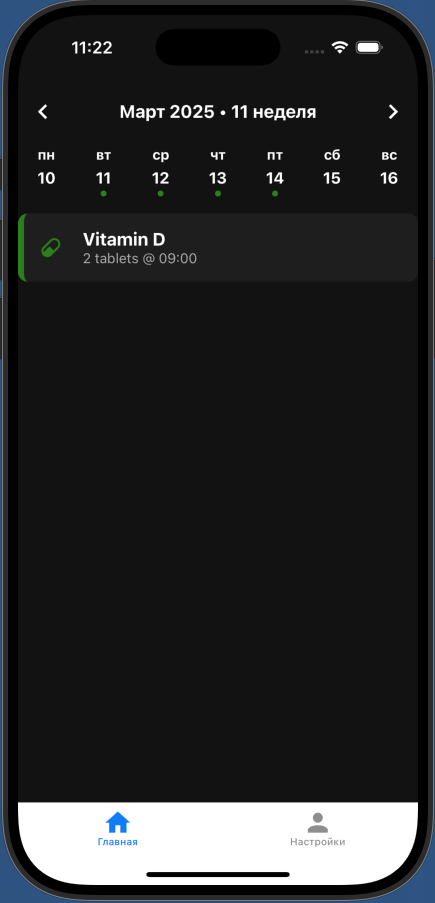
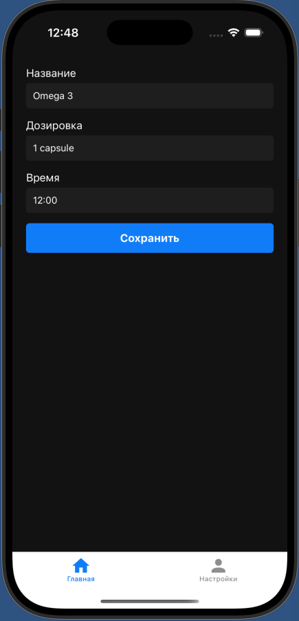
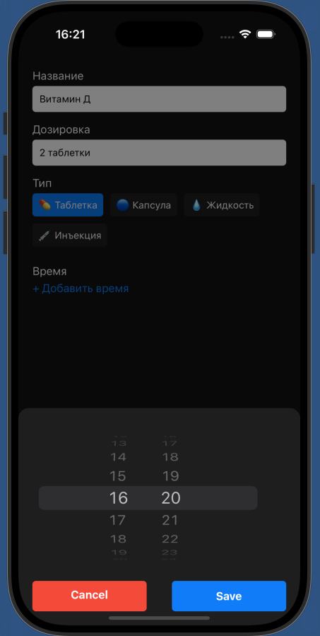
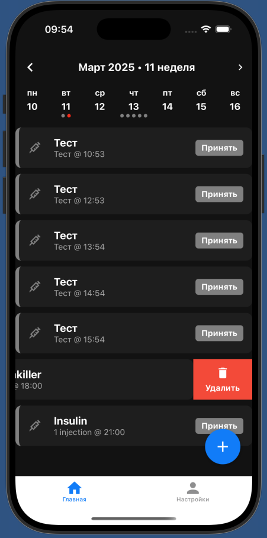
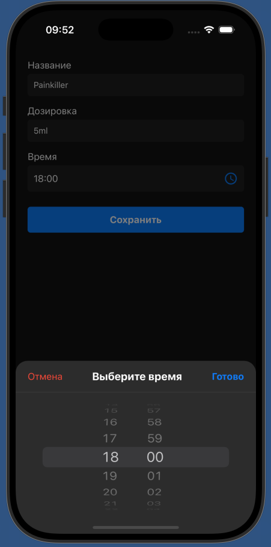

**To run you should:**
```sh
cd MedTrackApp
npx react-native run-ios
```

### Version 0.1 of application



### Version 0.2 of application


### Version 0.3. Improved AddReminders screen: type selection is with buttons, time selector is inapple clock app style.


### Version 0.4. Limited calendar dots to display only the first 5 reminders per day. Added time picker modal in EditReminderScreen similar to AddReminderScreen. Implemented sorting of reminders by time for each day.


#### Version 0.4.1. Added removing reminder by swiping it.


## Errors:
When opening AddReminder Screen right after building app I see error in debugger
ChatGPT tell to move addReminder to Context or Use navigation.setParams (find it in my gpt chats)
